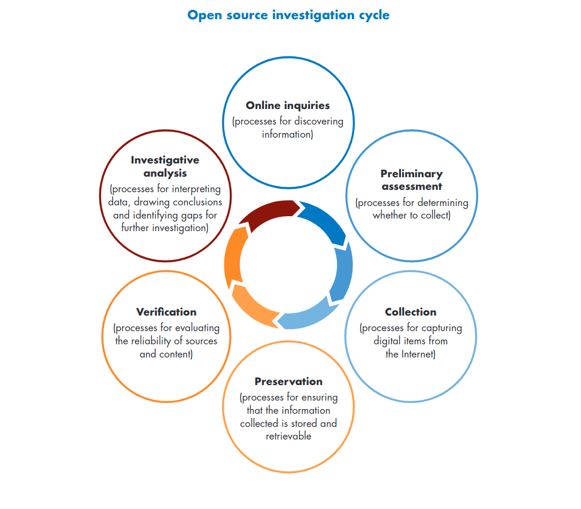
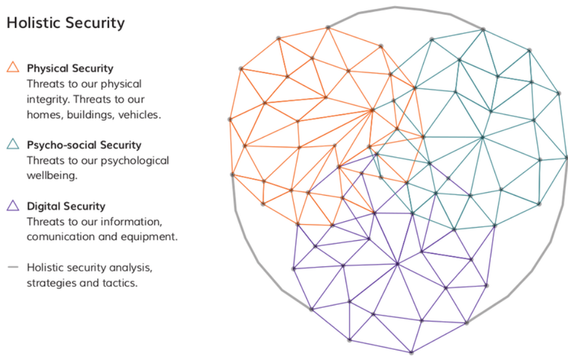
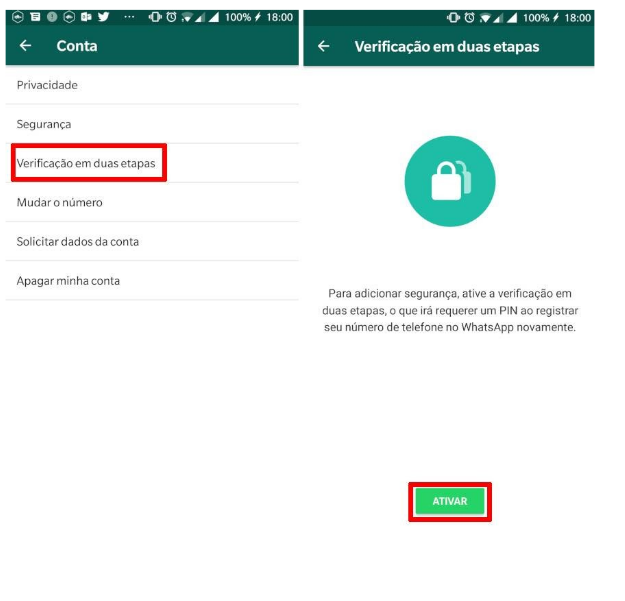
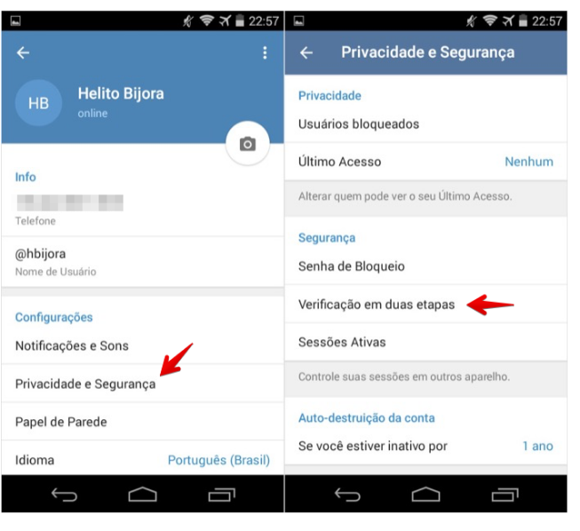

# Sobre mim
Jornalista e pesquisador, especializado em investigações baseadas em dados e técnicas de OSINT. Tem mestrado em Social Data Science pela Universidade de Oxford e em Comunicação pela UFRJ. 

Atualmente, colabora como [Bellingcat](bellingcat.com) no programa de Technical Writing Fellowship, desenvolvendo um tutorial sobre o uso de modelos de IA aplicados em investigações visuais. Também atua como consultor para o [Joint Data Center on Forced Displacement](https://www.jointdatacenter.org/), uma iniciativa do Banco Mundial com a Agência da ONU para Refugiados, e desenvolve análises de dados sobre misoginia online para o [Netlab/UFRJ](https://netlab.eco.ufrj.br/).

Coordenou a Escola de Dados entre 2018 e 2022 e já publicou investigações na Agência Pública, The Intercept Brasil e na agência [Documental.xyz](https://documental.xyz).

Mais informações: [belisario.website](belisario.website)

---

# Sobre o curso

Todos os slides e mais uma lista de outras referências úteis estão disponíveis em um repositório do Github (belisards/osint) e no link [belisario.website](https://belisario.website/osint).

--

**Ementa**

- Fundamentos de OSINT
  - Conceitos fundamentais
  - Caixas de ferramentas
  - Segurança digital
- Busca avançada na web
  - Operadores de busca avançada
  - Busca em redes sociais
  - Investigando sites
- Investigações visuais
  - Geolocalização de imagens
  - Imagens de satélite

---

# Sobre vocês

Para saber mais em que pé estamos:

- Já ouviram falar de OSINT?

--

- Sabem o que é OSINT?

--

- Já usaram técnicas de OSINT em investigações?

--

- Acompanha fontes de notícias ou informações sobre o tema?

--

- Quais as expectativas de aprendizado?

---

# Recursos

Abaixo alguns dos serviços online e programas que serão utilizados. 

Nenhum é obrigatório, porém seu uso é recomendado para acompanhar ou replicar alguns atividades.

- [Conta no Facebook](https://facebook.com/)
- [Conta no Instagram](https://instagram.com/)
- [Google Earth Pro](https://www.google.com/intl/pt-BR/earth/about/versions/#earth-pro)

---
class: inverse, center, middle

.extra-large[Conceitos fundamentais]

---

# O que é OSINT?
OSINT ou Open Source Intelligence (**inteligência com fontes abertas**) designa a coleta e análise de informações de fontes abertas para fins investigativos ou de tomadas de decisões estratégicas. 

--

Diversas áreas fazem uso das técnicas de OSINT, por exemplo:
- Forças militares ou estatais
- Empresas (inteligência empresarial)
- Empresas e especialistas em segurança da informação e cibersegurança
- Organizações de direitos humanos
- Jornalistas

--

Para se distanciar destes outros usos, há quem prefira traduzir OSINT como "investigações com fontes abertas".

---

# Fontes abertas?

.large["Informações de fontes abertas não envolvem interação ou solicitação de informações de usuários individuais da Internet"]<sup>1</sup>

Algumas fontes<sup>2</sup>, porém, falam de OSINT ativa ou ofensiva. Em geral, este não é o caso para nós, jornalistas.

.footnote[
[1] [Berkeley Protocol - United Nations Human Rights Office of the Comissioner and Human Rights Center of UC Berkeley School of Law](https://www.ohchr.org/Documents/Publications/OHCHR_BerkeleyProtocol.pdf)

[2] Por exemplo: [OSINT WTF - OHSHINT](https://ohshint.gitbook.io/oh-shint-its-a-blog/osint/osint-wtf#the-two-osint-approaches)
]
---

# Modos de obtenção

- **Observação**: informações acessíveis por qualquer pessoa, mesmo que tenha mecanismos de registro ou login. Dados que são passíveis de serem acessados apenas mediante brechas de segurança ou privacidade, em geral, não são considerados, tampouco aqueles que não permitem atribuição e verificação e, portanto, não podem ser utilizadas como evidências.

--

- **Compra**: é possível que as informações estejam à venda por serviços de terceiros. Desde que não incorra em nenhuma ilegalidade e que a compra seja disponibilizada a qualquer pessoa, em geral, estas informações são consideradas como "fontes abertas".

--

- **Solicitações**: requerimentos legais, via Lei de Acesso à Informação, por exemplo, também são considerados. Solicitações feitas a pessoas físicas, por meio de fóruns, chat ou email, podem ou não serem consideradas como fontes abertas, a depender do contexto.

---

# Princípios

- **Objetividade e acurácia**: fique atento a vieses que podem afetar sua investigação. Não só aqueles subjetivos, conscientes ou não, como também aqueles próprios da arquitetura da Internet. Por exemplo, a mesma consulta em um mecanismo de busca pode retornar resultados diferentes, a depender de fatores diversos, como a localidade, dispositivo, histórico do usuário, etc.

--

- **Ética e legalidade**: esteja ciente das diretrizes legais de proteção de dados e privacidade. Mesmo que a informação esteja disponíveis ao públicos, isso não quer dizer que não existem considerações legais quanto ao seu armazenamento. Especialmente ao usar processos automatizados, evite coletar mais dados do que o necessário e, se assim o fizer, remova as informações que não são necessárias para sua investigação.

--

- **Transparência e prestação de contas (accountability) **: documente todas etapas do seu trabalho, mantendo um registro de suas atividades. Sua metodologia pode ser questionada ou você pode ter que prestar contas em um julgamento oficial. Além disso, ainda que o uso de identidades anônimas seja importante, é preciso evitar a deturpação ou apresentações falsas (*misrepresentation*);


---

# Novas lentes para sua investigação

OSINT é sobretudo um estado de espírito.

Não se trata de usar ferramentas, mas de adotar uma outra forma de encarar suas investigações.

.large["OSINT como uma mentalidade requer pensamento crítico sobre como coletar dados brutos, refiná-los, além de ser transparente nos métodos usados, escolhas feitas e lacunas da análise".]<sup>1</sup>


.footnote[
[1] [OSINT Is A State Of Mind, por Dutch Osint Guy](https://medium.com/secjuice/osint-as-a-mindset-7d42ad72113d).
]

---

# O que você realmente precisa?

As ferramentas são úteis, mas as habilidades mais importantes em OSINT são:

- **Paciência** para achar a agulha no palheiro. 99% das suas tentativas não vão dar em nada, mas aquele 1%...

- **Método** para coletar novas informações e sistematizar os resultados de uma forma relevante.

- **Inteligência crítica** para avaliar a credibilidade das informações.

- **Olho para detalhes** que individualmente podem ser insignificantes, mas em conjunto podem ganhar sentido.

---

# Técnicas utilizadas

Saber técnicas e métodos é muito mais importante do que manejar ferramentas. Ferramentas mudam, as técnicas não. Mas faça suas escolhas: é impossível dominar tudo.

A seguir, uma lista não exaustiva de algumas que podem ser consideradas básicas:

.pull-left[
- Busca avançada: *Google dorkings* e recursos avançados de buscadores ou redes sociais;

- Pesquisa em acervos públicos (bibliotecas, jornais antigos, cartórios, etc);

- Buscas reversas de imagens;

- Geolocalização de imagens;
]

.pull-right[
- Uso de imagens de satélites para inspeção visual;

- Raspagem de dados;

- Análise de redes;

- Produção de mapas e cartografias;

]

---

# Técnicas utilizadas

A lista de técnicas utilizadas em investigações baseadas em fontes abertas pode seguir para incluir metodologias um pouco mais avançadas, como:

.pull-left[
- Análise sonora

- Análise espectral com dados de sensoriamento remoto

- Modelagem 3D

- Modelos de aprendizagem de máquina (machine learning), como clusterização
]

.pull-right[
- Modelos de visão computacional

- Fotogrametria

- Técnicas de análise forense 
]

---

# Etapas

Em geral, o uso de técnicas de inteligência com fontes abertas envolve um ciclo contínuo de etapas que **se retroalimentam**<sup>1</sup>. De forma resumida, são elas:

.pull-left[
- Planejamento e requisitos

- Coleta de informações

- Análise e processamento das informações

- Disseminação de resultados
]
.pull-right[
```{r, echo=FALSE, out.width = "100%"}

```
]
.footnote[
[1] [Berkeley Protocol](https://www.ohchr.org/Documents/Publications/OHCHR_BerkeleyProtocol.pdf)
]

---

# Planejamento de pesquisas em OSINT

Sugestões para começar:

- Defina os objetivos e alvos;

--

- Liste informações "sementes", ou seja, palavras-chave ou informações relevantes para o caso;

--

- Pense variações destas informações e adicione na lista;

--

- Organize potenciais fontes de informação e configure os acessos, se necessário;

--

- Planeje um método de sistematização dos resultados;

--

- Faça uma avaliação do risco envolvido;

---

# Coleta de informação

.pull-left[
## Buscas
- Vá além do Google: use diversos buscadores, redes sociais e bases de dados;

- Não leia apenas a primeira página;

- Use operadores de busca avançada para filtrar os resultados;

- Armazene listas e informações adicionais dos alvos principais (por exemplo, lista de amigos)
]

--

.pull-right[
## Monitoramento
- Buscadores: configuração de alertas para termos específicos (ex: Google Alerta);

- Redes sociais ou sites: alertas de postagens, TweetDeck, feeds RSS, etc;

- Sites: scripts para raspagem de dados, monitores de mudanças em websites, etc;
]

---

# Cadeia de custódia

Não altere os arquivos originais e tente manter uma cadeia de custódia dos materiais com informações que podem virar evidências críticas;

"Art. 158-A. Considera-se cadeia de custódia o conjunto de todos os procedimentos utilizados para manter e documentar a história cronológica do vestígio coletado em locais ou em vítimas de crimes, para rastrear sua posse e manuseio a partir de seu reconhecimento até o descarte."<sup>1</sup>

---

# Coleta de informação: arquivamento

Tente preservar elementos de atribuição:

- **URL**: registre o endereço na web onde o recurso está localizado;

- **Código-fonte da página**: guarde o código-fonte da página (Arquivo > Salvar). 

- **Captura de tela completa**: faça uma captura de tela que indique o dia e hora de algum modo. 

- **Arquivos de mídia**: se houver imagens, áudios ou vídeos relevantes, certifique-se que eles também foram armazenados separadamente;

- **Metadados ou dados contextuais**: registre também outras informações relevantes, como metadados (identificador do usário, data e hora de upload, hasthags, comentários, etc) ou informações contextuais (exemplo, perfil de quem fez determinada postagem);

Dados da coleta em si (IP, hora, etc) e hash (MD5, SHA1, etc) também podem ser utilizados em certos casos.

.footnote[
[1] Outros requerimentos legais da cadeia de custódia no Brasil estão detalhados no [Código Penal](https://www.jusbrasil.com.br/topicos/250911206/artigo-158a-do-decreto-lei-n-3689-de-03-de-outubro-de-1941).
]

---

# Coleta de informação: arquivamento

Conteúdos online podem ser removidos, faça arquivamentos online e/ou locais das informações importantes. Algumas ferramentas úteis:

- [Hunch.ly](https://hunch.ly/): plataforma bastante completa para arquivamento. Captura e anota automaticamente tudo que você navega;

- [Archives.is](https://archive.is/): website para arquivamento de conteúdo online;

- Para capturas de telas: [GoFullPage](https://gofullpage.com/) ou [Screencastfy](https://www.screencastify.com/)

---

# Análise: documentação é uma arte

Tomar notas e registrar suas descobertas é fundamental para transformar as informações brutas em algo relevante.

Ferramentas como o [Obsidian](https://obsidian.md) podem ajudar, mas tudo depende de disciplina.

Atenção também aos "dados invisíveis" como metadados em imagens ou informações escondidas no código-fonte das páginas web.

---

# Análise: vieses cognitivos

Use seus insights e experiências pessoais, mas tente fazer uma análise objetiva, especialmente para não incorrer em vieses comuns em processos investigativos como:

- **Viés de ancoragem**: a primeira impressão ou informação é a que fica;

- **Viés de confirmação**: tendemos a observar apenas informações que confirmam conceitos prévios;

- **Viés de disponibilidade**: supervalorizamos informações fáceis de achar;

- **Ilusões de agrupamento**: ver padrões onde eles não existem - correlação não é causalidade!;

.footnote[
[1] [Codex dos vieses cognitivos](https://pt.wikipedia.org/wiki/Vi%C3%A9s_cognitivo#/media/Ficheiro:Codex_Vi%C3%A9s_Cognitivos.jpg)
]

---
class: inverse, center, middle

.extra-large[Caixas de ferramentas]

---

# Repositórios de consulta

- [Bellingcat toolkit](https://bit.ly/bcattools)

- [OSINT Framework](https://osintframework.com/)

- [OSINT Brazuca](https://github.com/osintbrazuca/OSINT-Brazuca)

- [Awesome OSINT](https://github.com/jivoi/awesome-osint)

- [OSINT.sh](https://osint.sh)

- [Mapas mentais de elementos de pesquisa](https://github.com/sinwindie/OSINT)

---

# Programas e plataformas especializadas

Existem também programas e plataformas dedicados a potencializar investigações de OSINT. 

Abaixo, lista de alguns dos mais conhecidos:

- [Maltego](https://www.maltego.com/): a mais famosa ferramenta para investigações digitais, com diversos plugins. Baseado em grafos.

- [Social Links](https://sociallinks.io/): especialmente forte para análise de redes sociais.

- [Spiderfoot](https://github.com/smicallef/spiderfoot): foco em ciber-segurança e análise de ataques virtuais.

- [theHarvester](https://github.com/laramies/theHarvester): útil para investigar emails e sites, principalmente.

- [EffectGroup](https://effectgroup.io/): ótimo para buscar informações pessoais a partir de nomes e email, inclusive com dados de brasileiros. 

Mas há muito, muito mais. Hoje, em julho de 2024, existem mais de 2.300 projetos de código-aberto com a [tag "OSINT" no Github](https://github.com/topics/osint) - fora as plataformas privadas.

---

# Intervalo

```{r setup, include=FALSE}
options(htmltools.dir.version = FALSE)
```
<center>
<iframe width="560" height="315" src="https://www.youtube.com/embed/4G9S-eoLgX4" title="YouTube video player" frameborder="0" allow="accelerometer; autoplay; clipboard-write; encrypted-media; gyroscope; picture-in-picture" allowfullscreen></iframe>
</center>

---
class: center, inverse, middle

# Noções de segurança digital

---
class:center

#Segurança holística



Fonte: [Tactical Tech](https://holistic-security.tacticaltech.org/)

---

# Precauções para uma investigação

A segurança é parte fundamental da preparação de uma investigação. Ainda que as preocupações possam variar de acordo o tipo e o alvo da investigação em questão, existem recomendações gerais:

- **Tente se manter anônimo**: não deixe rastros facilmente vinculados a sua pessoa (use VPN ou TOR); se possível, use sistemas operacionais menos sucetíveis a softwares maliciosos (GNU/Linux)

- **Considere que você pode não ser anônimo**: mesmo com estes cuidados, considere sempre a possibilidade de estar sendo monitorado ou de seus arquivos pararem na mão de terceiros (roubos, apreensões policiais, etc).

---

# Compartimentalizar é chave

- **Redes sociais e contas online**: contas pessoais e profissionais não devem se misturar (*sockpuppets* ou bonecos de meia); 

- **Navegadores**: especialmente se você vai instalar plugins e add-ons que exigem acesso ao conteúdo das páginas, use um navegadores para sua atividade investigativa diferente daquele usado para fins pessoais. Além de mais segurança, você ganha a vantagem de não misturar os históricos de navegação.

- **Dispositivos**: se possível, use hardwares diferentes para fins profissionais e pessoais. Especialmente se você faz monitoramento de grupos de WhatsApp e Telegram, não use o seu celular ou número pessoal.

---

# Conheça-te a ti mesmo

Verifique se você já foi vítima de vazamentos: [HaveIBeenPwned](https://haveibeenpwned.com/Passwords). 

Faça uma auto-busca (ego search) para identificar informações pessoais suas que estão expostas, buscar removê-las se possível ou ainda se prevenir de possíveis utilizações maliciosas. 

Você pode buscar coisas como: nome completo, CPF, telefone, endereço, email, usuário, etc.

---

# Exponha-se menos

Configurações de privacidade: ajuste em detalhes quais informações e posts ficam disponíves para diferentes círculos de amizade.

Facebook: [https://www.facebook.com/help/325807937506242?ref=tos](https://www.facebook.com/help/325807937506242?ref=tos)

Instagram: [https://help.instagram.com/196883487377501](https://help.instagram.com/196883487377501)

WhatsApp: [https://faq.whatsapp.com/3307102709559968/?cms_platform=web&locale=pt_BR](https://faq.whatsapp.com/3307102709559968/?cms_platform=web&locale=pt_BR)

---

# Acessos descartáveis

Você sabia que pode usar emails e telefones descartáveis para cadastros efêmeros?

Existem vários. Busque por “temp mail” ou “temp phone”.

- [https://temp-mail.org/pt/](https://temp-mail.org/pt/)

- [https://sms24.me/en/](https://sms24.me/en/)

---

# Não repita senhas

Considere usar um gerenciador de senhas.

Uma ferramenta específica para armazenar senhas traz vantagens como:

- Você não precisa decorar várias senhas, apenas uma;

- Você irá usar apenas [senhas fortes](https://bitwarden.com/password-strength/);

- Você nunca mais irá repetir um senha;

- Facilita o gerenciamento de contas extras (sockpuppets) 

- Funciona em vários dispositivos;

Alguns gerenciadores de senha que você pode experimentar: [KeePass](https://keepass.info/) e [Bitwarden](https://bitwarden.com/) possuem código-aberto. O [1password](https://1password.com/pt/) é pago, mas oferece gratuidade para jornalistas.

---
# 2FA - Autenticação dois fatores

Autenticação com dois elementos diferentes. Exige algo que você saiba (senha) e tenha (um celular, um código de uso único/OTP, etc). 

Fundamental que você ative na sua conta de email principal e serviços como WhatsApp, Telegram, e redes sociais.

```{r, echo=FALSE, out.width = "60%"}

```

---

.pull-left[

]

.pull-right[

]

---

# Navegação anônima

Qual a diferença entre ~~o charme e o funk~~ VPN e o TOR?

--

.pull-left[

## VPN
- Serviço centralizado em único provedor
- Exige confiança em uma única empresa
- Pago. Desconfie e evite serviços gratuitos
- Latência baixa e possiblidade de escolher a localidade do seu ponto de saída para a Internet
]

.pull-right[
## TOR

- Projeto gratuito, descentralizado e de código-aberto
- Estado da arte em termos de navegação anônima na web
- Exige confiança apenas na arquitetura e software
- O tráfego passa por pontos aleatórios na rede
- Protege apenas o tráfego do navegador com TOR
- Mais lento e bloqueado em alguns sites
]

---

# Recursos e referências extras

- [Brave Browser](https://brave.com/): navegador de código-aberto com TOR embutido;

- [PrivacyBadger](https://privacybadger.org/): plugin da Electronic Frontier Foundation para impedir que sua navegação seja monitorada por anunciantes e outros rastreadores;

- [Duckduckgo](https://duckduckgo.com/): buscador web focado em privacidade;

- [Security in a box](https://securityinabox.org/en/);

- [Autodefesa contra vigilância](https://ssd.eff.org/pt-br): guia da Electronic Frontier Foundation;

- [Guia de autodefesa](https://guia.autodefesa.org/);


---

class: center, middle, inverse

# Até amanhã!

[belisario.website/osint](https://belisario.website/osint/)