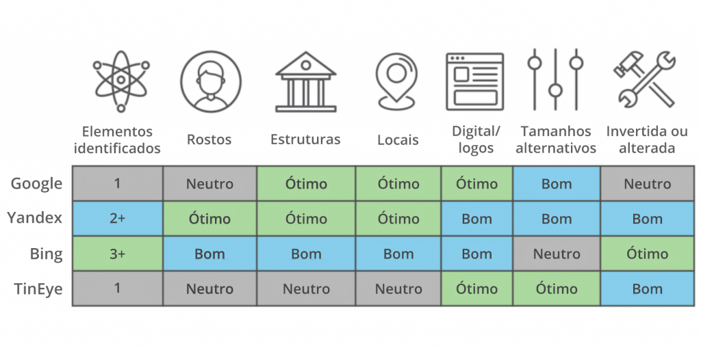

class: center, middle

# Apresentações e materiais do curso:

### github.com/belisards/osint

Slides criados com o pacote R [**xaringan**](https://github.com/yihui/xaringan).

---
# O que temos para hoje?

- Buscadores na web
- Busca reversa de imagem
- Busca em redes sociais
- Investigando sites

---
# Busca avançada no Google

Para uma lista completa dos operadores de busca avançado, confira este [tutorial da Escola de Dados]().

- Aspas para expressões exatas;

- Sinal de menos para excluir;

- Asterisco é o coringa;

- `Ferramentas > Em qualquer data`: para delimitar um intervalo de tempo;

--

## Operadores booleanos
- `AND`: para afunilar os termos de pesquisa. No Google, um espaço em branco equivale a um `AND`;

- `OR` para colocar alternativas de termo;

- Parênteses para isolar o termo;

---

## Exemplos
`(ussr OR russia) AND (eua OR usa)`

`prevenção -alcoolismo`

---

# Outros operadores 
- `site:` restringir a busca a um determinado site ou domínio;
- `filetype:` restringir a busca a um formato de arquivo;
- `cache:` para pesquisar a versão arquivada de um site;
- `intitle:` e `allintitle:` buscam apenas no título da página;
- `..` (dois pontos) :cobrem um intervalo numérico
- `before`: pesquisa antes de uma determinada data (YYYY-MM-DD)

--

## Exemplos

`site:*.pmerj.rj.gov.br -www`

`intitle:osint site:twitter.com/i/lists`

`inflação 1990..2000`

`inflação before:2010-01-01 site:folha.uol.com.br`

`"secretaria * de saúde" site:gov.br filetype:xls`

---
class: inverse, center, middle

# Busca na web ≠ Google 

---

# Outros buscadores

- Duckduckgo: buscador com foco em privacidade;

- Bing: buscador da Microsoft. Ao contrário do Google, leva em consideração relevância em redes sociais e não prioriza sites adaptados para dispositivos móveis;

- Yandex: o principal buscador da Rússia;

- Baidu: o principal buscador da China;
 
- Carrot2: buscador que organiza os resultados em tópicos e

- Internet Archive: o túnel do tempo da web;

---
# Busca reversa de imagens

[A brief comparison of reverse image searching platforms]()

---
# Busca em redes sociais
## Twitter

- [Tweetdeck](https://tweetdeck.twitter.com/)

---

# Facebook

- Seção de ["'"Transparência das páginas"](https://www.facebook.com/help/323314944866264)
- [Who Posted What](https://www.whopostedwhat.com/)
- [Graph.tips](https://graph.tips/beta/)
- [Facebook Matrix](https://plessas.net/facebookmatrix)

---

# Investigação de sites

- Who.is

---

class: center, middle
# Obrigado!