# O que temos para hoje?

- Investigações visuais
  - Busca reversa de imagens
  - Terra à vista: imagens de satélites
  - Geolocalização e cronolocalização de imagens

---
class: inverse, center, middle

.extra-large[Busca reversa]

---
# Busca reversa

Buscadores "tradicionais": [Google](https://google/); [Bing](https://bing.com/); [Yandex](https://yandex.com)

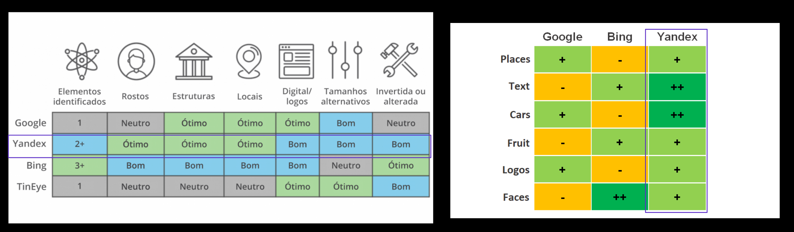
Buscadores de pessoas: [PimEyes](https://pimeyes.com/en) e [Facecheck](https://facecheck.id/)

[Remover elementos da imagem](https://cleanup.pictures/) que sobrepõe a entidade principal de seu interesse pode ajudar.

.footnote[
Atenção: a comparação pode estar desatualizada!
]


---
class: inverse, center, middle

.extra-large[Imagens de satélite]

---
class: center
# Imagens de satélite
```{r, echo=FALSE, out.width = "50%"}
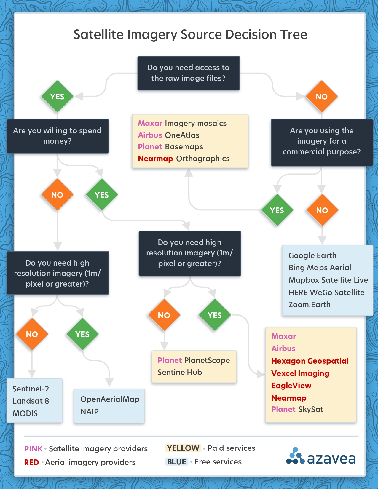
```

.footnote[Fonte: [Azavea](http://www.azavea.com/wp-content/uploads/2021/03/azavea_satellite_imagery_decision_tree_2021.pdf)
]

---
# Imagens de satélites: alternativas pagas

Atualmente, a maior resolução de imagens de satélites disponíveis comercialmente varia entre 30 e 50 centímetros GSD (ground sampling distance , ou seja, a distância real entre o centro de dois pixels).

```{r, echo=FALSE, out.width = "40%"}
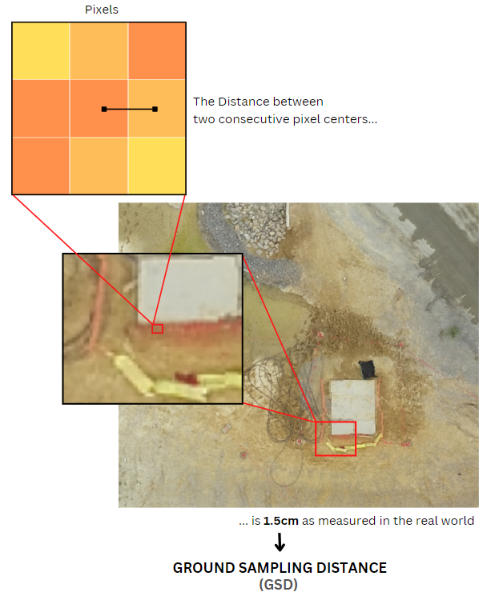
```

---

# Fornecedores comerciais

- [Maxar](https://www.maxar.com): a maior e mais antiga fornecedora de imagens de satélites dos EUA. Espere preços na ordem de milhares de dólares e imagens com resoluções de até 30cm;

- [Airbus](https://www.intelligence-airbusds.com): baseada na França, tem arquivos até dos anos 1980 e também está na ordem dos milhares de dólares;

- [Planet](https://planet.com): a maior parte das imagens conta com uma resolução menor que as anteriores, porém é mais barato. Imagens de arquivos podem sair por "apenas" centenas de dólares.

.footnote[Fonte: [How to find the latest satellite imagery in 2021](https://www.azavea.com/reports/how-to-find-the-latest-satellite-imagery-in-2021/).
]

---
class: inverse, center, middle

# "Ainda não vivemos em uma era de imagens de satélite de alta resolução ubíquas e acessíveis"

.footnote[[How to find the latest satellite imagery in 2021](https://www.azavea.com/reports/how-to-find-the-latest-satellite-imagery-in-2021/).
]


---

# Nós não vamos pagar nada

As principais soluções são:

- Sentinel-2: da agência espacial europeia, cobertura a cada 5 dias, aproximadamente. Resolução: 10 a 60 metros.

- Landsat 8: do serviço geológico norte-americano, tira uma "foto" da Terra a cada ~16 dias. Resolução: 15 a 30 metros.

- A [NASA](firms.modaps.eosdis.nasa.gov) ofere serviços específicos para monitoramento de queimadas.

.footnote[Fonte: [How to find the latest satellite imagery in 2021](https://www.azavea.com/reports/how-to-find-the-latest-satellite-imagery-in-2021/).
]

---

# Alternativas úteis e gratuitas

- [SentinelHub EO Browser](https://apps.sentinel-hub.com/eo-browser/): útil para fazer buscas e comparações;

- [Bing maps](https://www.bing.com/maps/?cc=br): alternativa ao Google;

- [Zoom.earth](https://zoom.earth/): satélite MODIS, mais usado para análises climáticas;

- [World Imagery Wayback](https://livingatlas.arcgis.com/wayback/): serviço via ArcGIS, acesso fácil a imagens de satélites antigas;

- [Open Aerial Map](https://map.openaerialmap.org): catálogo colaborativo para fotos áreas (drones);


---

# Soluções do Google

Veja [todas as soluções para dados geográficos](https://www.google.com/intl/pt-BR_br/earth/outreach/tools/) ou confira aqui alguns destaques:

- [Google Earth](https://earth.google.com/): tem a versão web e o [Google Earth Pro](https://www.google.com.br/earth/download/gep/agree.html) para instalar no computador e ter mais recursos para análises;

- [Google Earth Studio](https://www.google.com/intl/pt-BR/earth/studio/): permite fazer gravações e [vídeos como este](https://drive.google.com/file/d/1s8OV7_q89L1iCsrV7vdH2u6kWNTVHSPU/view?usp=sharing);

- [Google Maps/StreetView](https://maps.google.com): soluções web que você provavelmente já conhece;

---

# Vá além do Google!

[Satellites.Pro](https://satellites.pro) permite alternar facilmente entre alguns provedores de imagem, mas pode valer a pena abrir os sites individualmente para explorar as marcações. Esse site aqui pode ajudar: [https://cybdetective.com/quickgeolocationsearch.html](https://cybdetective.com/quickgeolocationsearch.html)

Resultados do Bing vs Google (-2.48759, -54.66169) em maio de 2022.

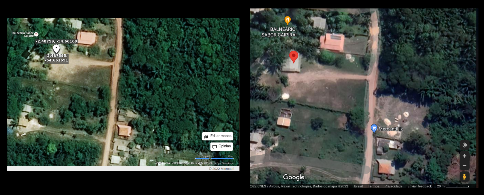

---

# Timelapse

Duas opções para criar timelapses de imagens de satélite:

- [Google Earth Pro](https://www.google.com.br/earth/download/gep/agree.html)

- [SentinelHub EO Browser](https://apps.sentinel-hub.com/eo-browser/): 

---
class: inverse, center, middle

.extra-large[Geolocalização]

---

# Geolocalização: caso real

[Reportagem sobre a influência da Cambridge Analytica](https://projetocolabora.com.br/ods8/o-que-se-sabe-sobre-a-atuacao-da-cambridge-analytica-no-brasil/): o encontro de Eduardo Bolsonaro e o Steve Bannon.

```{r, echo=FALSE, out.width = "30%"}
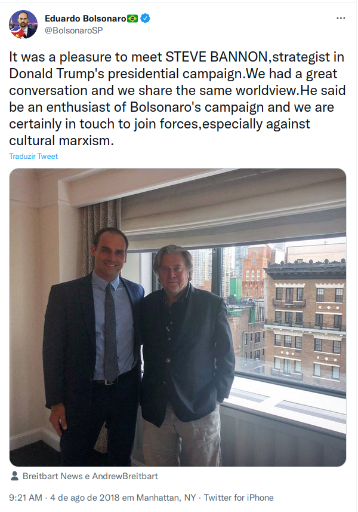
```

[https://twitter.com/bolsonarosp/status/1025718449425788929](https://twitter.com/bolsonarosp/status/1025718449425788929)


---

# Geolocalização: caso real

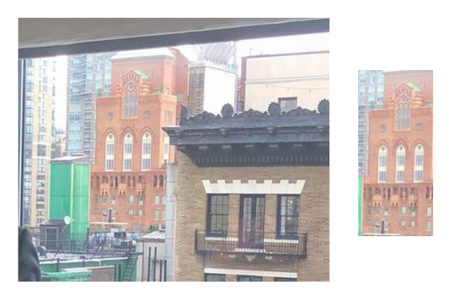
---

# Geolocalização: caso real


---

# Geolocalização: caso real

```{r, echo=FALSE, out.width = "50%"}
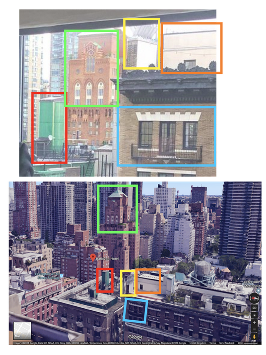
```


---

# Geolocalização: caso real

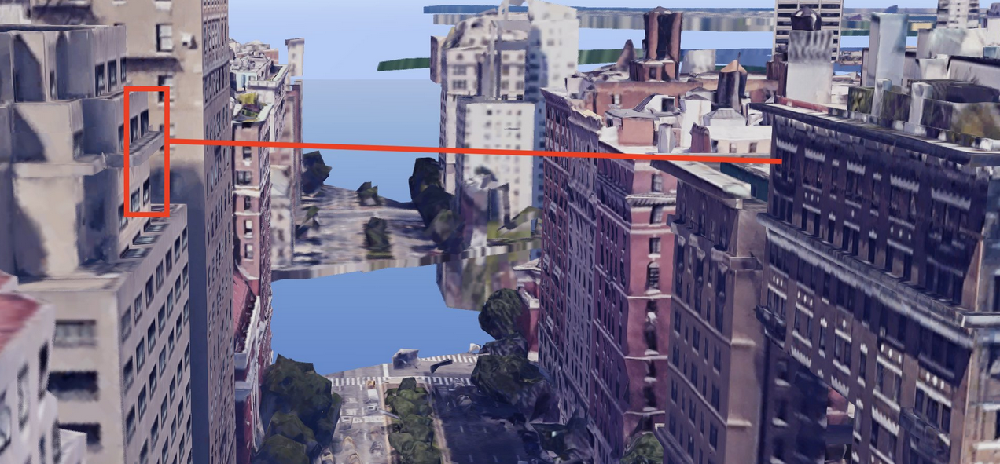
---

# Geolocalização: caso real

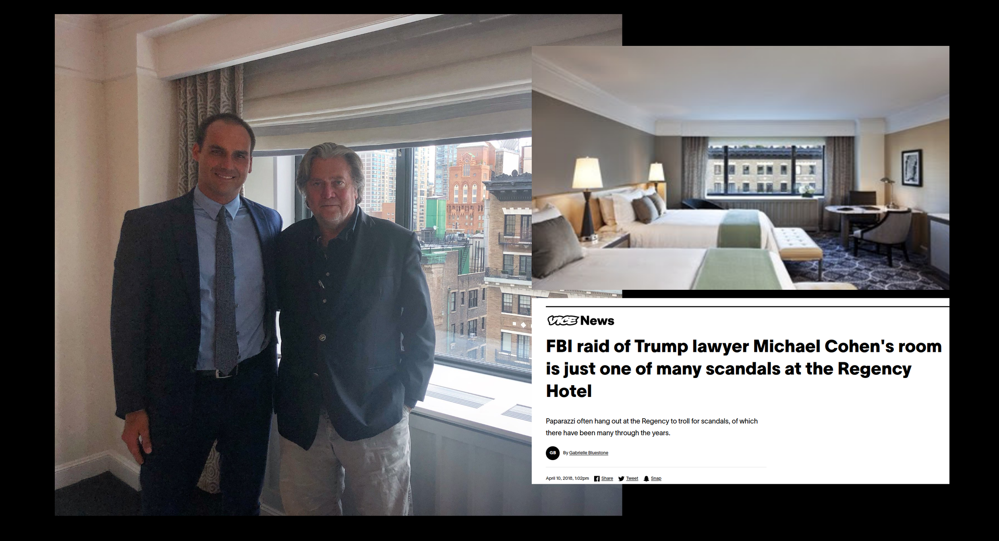
---

# Dicas iniciais

- Separe a imagem em quadrantes ou o vídeo em frames. Analise minuciosamente.

- Busque assinaturais visuais: anúncios, cartazes, construções, reformas, demolições, câmeras de segurança, placas, pôsteres, anúncios, produtos, relógios, roupas, vegetação, árvores, flores, condições do tempo.

- Tente a busca reversa com a imagem toda e diferentes enquadramentos.

- [Desenhar um mapa de visão aérea à mão ajuda](https://kit.exposingtheinvisible.org/en/geolocation.html)


---

# Recursos

- Imagens de rua: fotos do Google Maps, Street View, [Kartaview](https://kartaview.org)

- Análise 3D e relevo: Google Earth Pro, [F4 Maps](https://demo.f4map.com), [Peakfinder](https://www.peakfinder.com)

- Busca pela API do Open Street Maps (Overpass Turbo): [OSM Search](https://osm-search.bellingcat.com/) ou [What is Where](https://www.whatiswhere.com/)

- [Caixa de ferramentas para geolocalização](https://github.com/The-Osint-Toolbox/Geolocation-OSINT)

--

## Inteligência artificial

- [Picarta](https://picarta.ai/): conta com uma API com cota gratuita.

- [GeoSpy](https://geospy.ai/): serviço baseada em IA para identificar a localização de imagens;

- [StreetCLIP](https://huggingface.co/geolocal/StreetCLIP): modelo de código aberto de classificação zero-shot;

---
class: inverse, center, middle

.extra-large[Cronolocalização]

---

# Cronolocalização

Responde o "quando?";

A geolocalização é primordial para a cronolocalização;

Em geral, lidamos com intervalos de tempo, não momentos exatos (momento anterior e posterior);

A análise do sol/sombras é uma das técnicas mais comuns;

---

# Recomendações iniciais

Aumentar o contraste da imagem pode ajudar a visualizar as sombras;

A sombra deve ser projetada em uma superfície plana (exceto para modelagens 3d);

A foto não deve ser capturada com lentes distorcidas, tipo olho de peixe.

Cuidado com a influência de fontes artificiais de iluminação ou de reflexo (por ex, prédios espelhados) ao analisar sombras;

---

```{r, echo=FALSE, out.width = "50%"}
knitr::include_graphics("pics/aula3/sombras_retas.png")
```


---

# A sombra de um objeto reflete a altura do sol

A proporção entre um objeto e sua sombra (o ângulo formado por eles) indica a altura/elevação do sol. Logo, objetos e pessoas podem ser como um relógio de sol nas imagens.


```{r, echo=FALSE, out.width = "40%"}
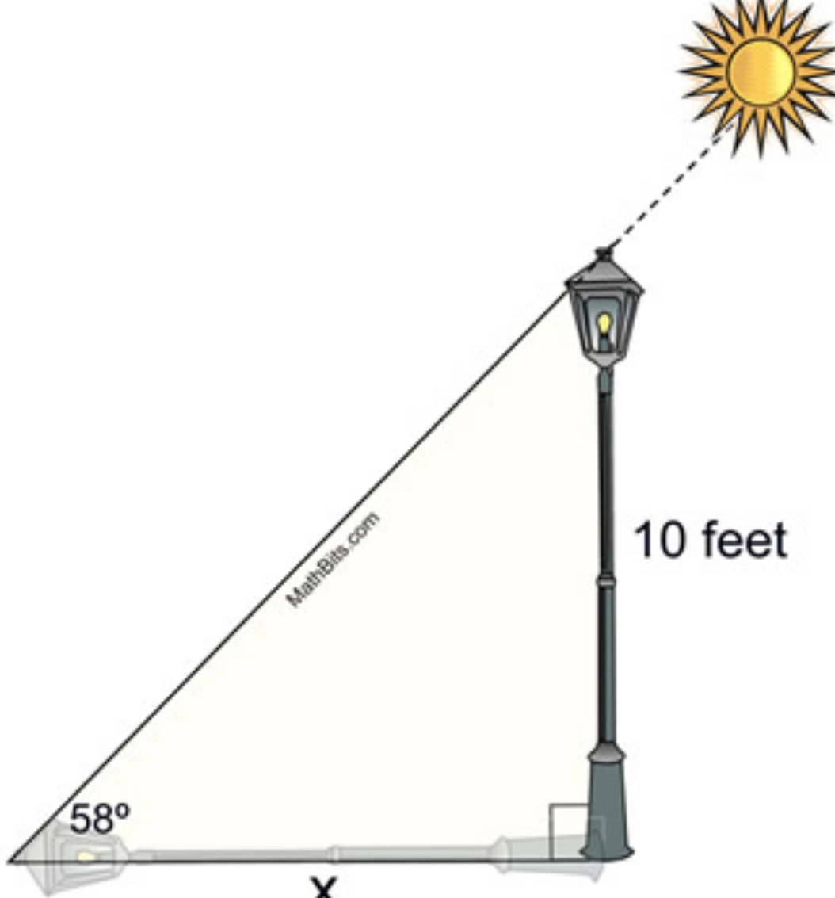
```

---

# Calculando o ângulo da sombra

Meça o objeto e sua sombra. Não importa a unidade  de medida.


```{r, echo=FALSE, out.width = "40%"}
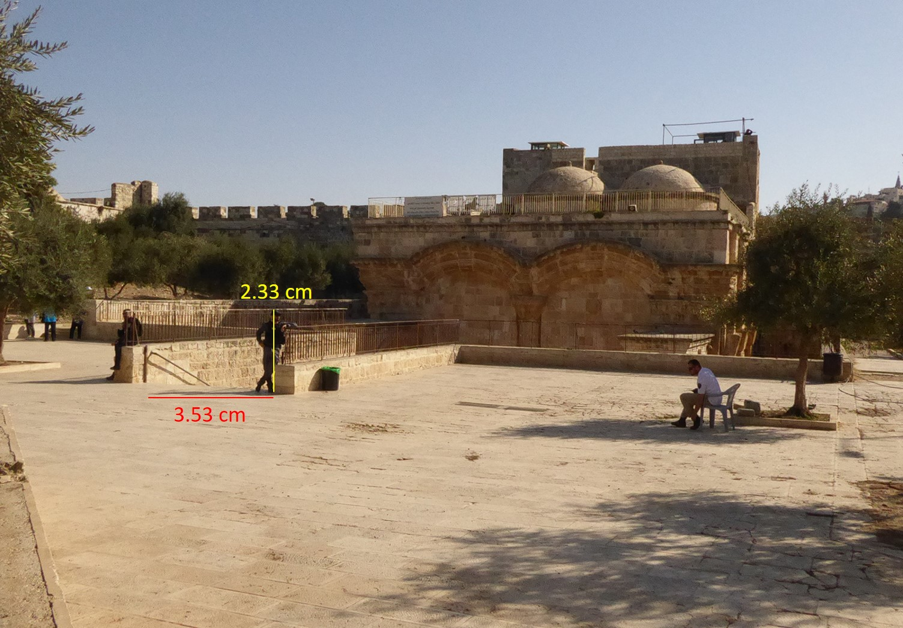
```

Quem disse que trigonometria não serve pra nada? Mas você [não precisa decorar fórmulas](https://tools.render.com.br/gratuito/triangulo_retangulo)!

.footnote[

Fonte: [Bellingcat: Unsure When a Video or Photo was Taken? How to Tell by Measuring the Length of Shadows](https://www.bellingcat.com/resources/2021/05/18/unsure-when-a-video-or-photo-was-taken-how-to-tell-by-measuring-the-length-of-shadows/)

]

---

# Azimute

O azimute é mede a direção horizontal, em graus, em relação ao norte. O grau de elevação/altitude se repete duas vezes em 24 horas. O azimute, não.

O azimute de uma sombra indica o horário, se sabemos o dia e o local. É possível [medir o azimute no Google Earth Pro](https://sector035.nl/articles/chronolocation-of-media)!

```{r, echo=FALSE, out.width = "50%"}
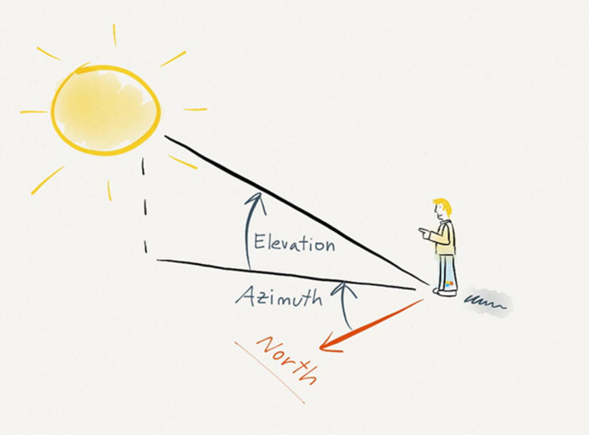
```

---

# Operacionalizando a cronolocalização

1. Faça a análise visual para extrair informações úteis como as condições climáticas, altura do sol e azimute.

1. Faça a geolocalização da imagem

1. Identifique o dia no qual a foto foi tirada. É possível deduzir o dia da imagem investigando as ocorrências de azimute e elevação em uma dada localidade consultando [bases de dados da trajetória anual do sol](https://sector035.nl/articles/chronolocation-of-media#62-date-and-time-calculations). Veja a seção ‘Date e time calculations’ do tutorial [‘Chronolocation of Media’](https://sector035.nl/articles/chronolocation-of-media#62-date-and-time-calculations).

1. Use ferramentas online para ver o horário correspondente: [SunCalc.org](https://www.suncalc.org), [Sun Path 3d](https://andrewmarsh.com/apps/staging/sunpath3d.html), [Shadowmap](https://app.shadowmap.org/), etc;

1. Para verificar os resultados ou ajudar a afunilar datas possíveis, vale [checar o histórico da previsão do tempo](https://www.timeanddate.com) na localidade.

---

# Tutoriais

1. [Checagem de imagens: cronolocalização de fotos](https://escoladedados.org/tutoriais/checagem-de-imagens-cronolocalizacao-de-fotos/)

1. Calculate time using shadows

```{r setup, include=FALSE}
options(htmltools.dir.version = FALSE)
```
<center>
<iframe width="560" height="315" src="https://www.youtube.com/embed/9z26rSP2eqs" title="YouTube video player" frameborder="0" allow="accelerometer; autoplay; clipboard-write; encrypted-media; gyroscope; picture-in-picture" allowfullscreen></iframe>
</center>

---

# Referências extras

- [Geolocation: step by step](https://kit.exposingtheinvisible.org/en/geolocation.html)

- [Geolocating a video, a basic tutorial](https://www.osinteditor.com/resources/guides/geolocating-a-video-a-basic-tutorial/)

- [Análise de sombras](https://medium.com/quiztime/lining-up-shadows-2351ae106cec)

- [Qgis2threejs](https://github.com/minorua/Qgis2threejs) (exemplo de uso com [Brumadinho](https://smaprs.github.io/BrumadinhoDam/))

- [Satellite images for journalism](https://news.climate.columbia.edu/2021/03/31/find-satellite-images-journalism/)

- [Hugin](http://hugin.sourceforge.net/): para criar panoramas a partir de imagens;

- [Mapchecking](https://www.mapchecking.com/): calcula o total de pessoas em uma certa área;

---
class: center, middle, inverse

# Obrigado!

[belisario.webiste/osint](https://belisario.webiste/osint)
