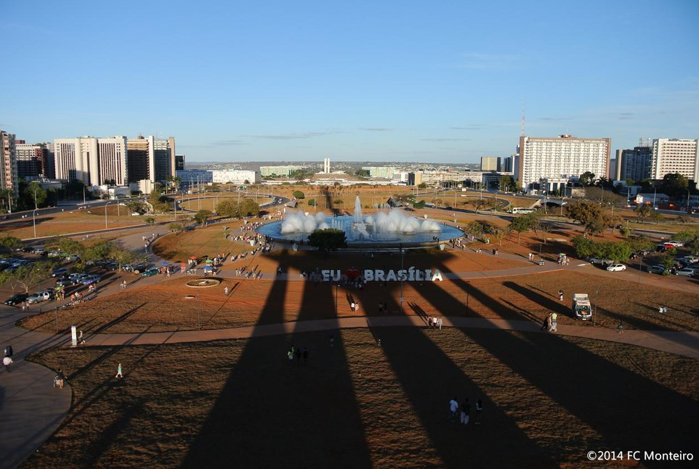

class: center, middle

# Apresentações e materiais do curso:

### [belisards.github.io/osint](https://belisards.github.io/osint/)

Slides criados com o pacote R [**xaringan**](https://github.com/yihui/xaringan).

---
# O que temos para hoje?

- Imagens de satélites: alternativas pagas e gratuitas;

- Acessando mapas online e outras ferramentas geo;

- Recursos e práticas para geolocalizar fotos e vídeos;
 
---
class: inverse, center, middle

# Imagens de satélite e mapas

---
class: center
```{r, echo=FALSE, out.width = "60%"}
knitr::include_graphics("pics/aula3/satellite.jpeg")
```

.footnote[Fonte: [Azavea](http://www.azavea.com/wp-content/uploads/2021/03/azavea_satellite_imagery_decision_tree_2021.pdf)
]

---
# Imagens de satélites: alternativas pagas

Atualmente, a maior resolução de imagens de satélites disponíveis comercialmente varia entre 30 e 50 centímetros GSD (ground sampling distance , ou seja, a distância real entre o centro de dois pixels).

As principais fornecedoras comerciais são:

- [Maxar](https://www.maxar.com): a maior e mais antiga fornecedora de imagens de satélites dos EUA. Espere preços na ordem de milhares de dólares e imagens com resoluções de até 30cm;

- [Airbus](https://www.intelligence-airbusds.com): baseada na França, tem arquivos até dos anos 1980 e também está na ordem dos milhares de dólares;

- [Planet](https://planet.com): a maior parte das imagens conta com uma resolução menor que as anteriores, porém é mais barato. Imagens de arquivos podem sair por "apenas" centenas de dólares.

.footnote[Fonte: [How to find the latest satellite imagery in 2021](https://www.azavea.com/reports/how-to-find-the-latest-satellite-imagery-in-2021/).
]

---
class: inverse, center, middle

# "Ainda não vivemos em uma era de imagens de satélite de alta resolução ubíquas e acessíveis"

.footnote[[How to find the latest satellite imagery in 2021](https://www.azavea.com/reports/how-to-find-the-latest-satellite-imagery-in-2021/).
]


---
# Nós não vamos pagar nada

As principais soluções são:

- Sentinel-2: da agência espacial europeia, cobertura a cada 5 dias, aproximadamente;

- Landsat 8: do serviço geológico norte-americano, tira uma "foto" da Terra a cada ~16 dias;

- MODIS: satélites da NASA, cobertura entre 1 e 2 dias;

Todas estão disponíveis para download em serviços da Amazon ([Earth on AWS](https://aws.amazon.com/pt/earth/)) ou do Google ([Earth Engine Catalog](https://developers.google.com/earth-engine/datasets/catalog/)).

Porém, você deve encontrar imagens em uma resolução pior do que está acostumado - e são arquivos enormes.

.footnote[Fonte: [How to find the latest satellite imagery in 2021](https://www.azavea.com/reports/how-to-find-the-latest-satellite-imagery-in-2021/).
]
---

# Alternativas úteis e gratuitas

- [SentinelHub EO Browser](https://apps.sentinel-hub.com/eo-browser/): útil para fazer buscas e comparações;

- [Open Aerial Map](https://map.openaerialmap.org): catálogo colaborativo para fotos áreas (drones);

- [Bing maps](https://www.bing.com/maps/?cc=br): alternativa ao Google;

- [Satellites.pro](https://satellites.pro): combina diferentes serviços;

- [Zoom.earth](https://zoom.earth/): utiliza o satélite MODIS;


---
## Soluções do Google

Veja [todas as soluções para dados geográficos](https://www.google.com/intl/pt-BR_br/earth/outreach/tools/) ou confira aqui alguns destaques:

- [Google Earth](https://earth.google.com/): tem a versão web e o [Google Earth Pro](https://www.google.com.br/earth/download/gep/agree.html) para instalar no computador e ter mais recursos para análises;

- [Google Earth Studio](https://www.google.com/intl/pt-BR/earth/studio/): permite fazer gravações e [vídeos como este](https://drive.google.com/file/d/1s8OV7_q89L1iCsrV7vdH2u6kWNTVHSPU/view?usp=sharing);

- [Google Maps/StreetView](https://maps.google.com): soluções web que você provavelmente já conhece;

---

# Recursos para geo/cronolocalização e outras ferramentas úteis

- [SunCalc.org](https://www.suncalc.org): para calcular a posição do sol e ajudar a localizar imagens no tempo;

- [TimeAndDate](https://www.timeanddate.com): histórico de previsão do tempo;

- [Hugin](http://hugin.sourceforge.net/): para criar panoramas a partir de imagens;

- [Mapchecking](https://www.mapchecking.com/): calcula o total de pessoas em uma certa área;

- [DescaterLab](https://search.descarteslabs.com): "busca reversa" em imagens de satélites;

---
class: inverse, center, middle

# Vamos praticar!

---


# Foto de 17/08/2014. Descubra o horário.



---

# Descobriu?

.footnote[Cheque o resultado no [link para a foto original](https://www.flickr.com/photos/fcmont/14783157308).
]

---
# Competição 

Vamos fazer um round no [Geoguessr](https://www.geoguessr.com/).

Depois, compartilhe sua pontuação!

---

# Referências extras

- [Geolocating a video, a basic tutorial](https://www.osinteditor.com/resources/guides/geolocating-a-video-a-basic-tutorial/)

- [Cleared for Takeoff: Exploring Microsoft Flight Simulator 2020's Research Potential](https://www.bellingcat.com/resources/case-studies/2020/08/24/cleared-for-takeoff-exploring-microsoft-flight-simulator-2020s-research-potential/)

- [Shadows and Suncalc](https://medium.com/quiztime/lining-up-shadows-2351ae106cec)

- [Coletâneas de webserviços para o QGIS](https://github.com/belisards/qgis_resources)

- [Qgis2threejs](https://github.com/minorua/Qgis2threejs) (exemplo de uso com [Brumadinho](https://smaprs.github.io/BrumadinhoDam/))
---

class: center, middle
# Obrigado!
