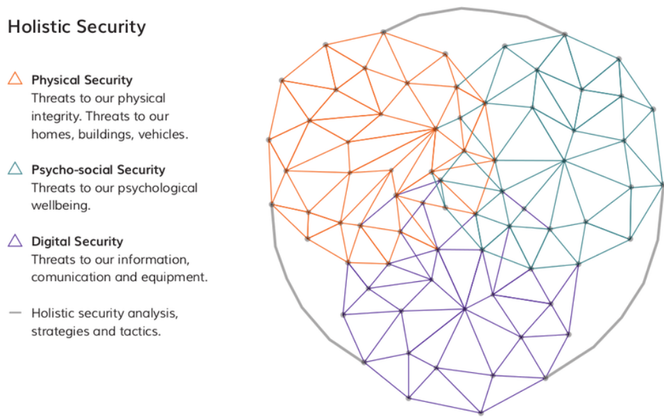
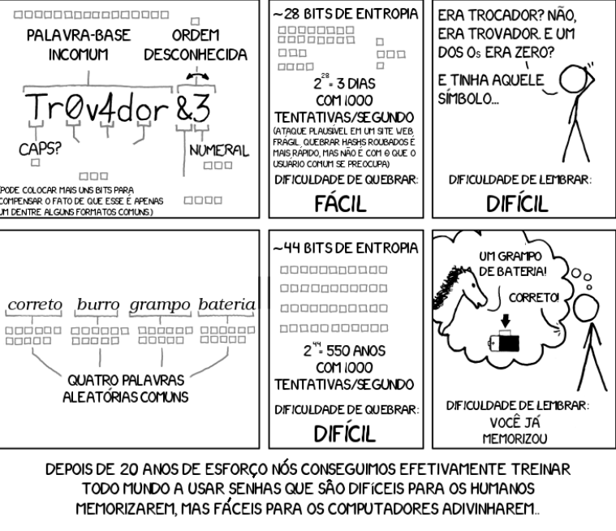
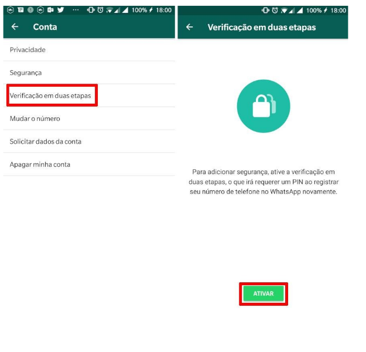
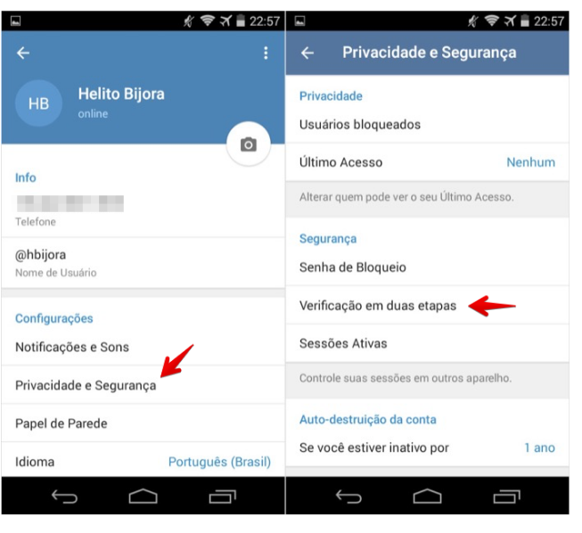

class: center, middle

# Apresentações e materiais do curso:

### [belisards.github.io/osint](https://belisards.github.io/osint/)

Slides criados com o pacote R [**xaringan**](https://github.com/yihui/xaringan).

---
# O que temos para hoje?
- Investigação de sites
- Noções de segurança digital
- Navegando na web de forma anônima
- Autenticação e senhas

---
# Investigação de sites: who is?

Existem vários serviços para consultar informações sobre quem registrou um domínio. Este tipo de consulta é conhecida como "who is".

- [Who.is](https://who.is): uma das soluções internacionais;

- [Whois - Registro.Br](https://registro.br/tecnologia/ferramentas/whois/): ótimo para domínios `.br`;

- [Reverse whois - ViewDNS.info](https://viewdns.info/reversewhois/): busca reversa com nome ou email;

--

## Buscas históricas

- [Domain Research Suite](https://tools.whoisxmlapi.com)

- [Whoxy](https://www.whoxy.com/): freemium;

- [Whoxology](https://whoisology.com/): serviço pago;


---
# Robots.txt

Arquivo utilizado para indicar para mecanismos de buscas, robôs e raspadores automatizados aquilo que eles **não devem** olhar. 

Exemplo do site da [Câmara federal]():

```
User-Agent: *
Disallow: /sileg/prop_lista*
Disallow: /internet/sileg/prop_lista*
Disallow: /sileg/Prop_lista*
Disallow: /internet/sileg/Prop_lista*
Disallow: /*arvore-de-apensados
Disallow: /proposicoesWeb/prop_arvore_tramitacoes
Disallow: /sileg/prop_arvore_tramitacoes
Disallow: /internet/deputado/Dep_Lista*
Disallow: /transparencia/recursos-humanos/remuneracao/*
Disallow: /transparencia/recursos-humanos/contratos-terceirizacao*
Disallow: /transparencia/recursos-humanos/funcionarios*
```
---
# Robots.txt

Você pode usar operadores de busca para pesquisar coisas interessantes em sites oficias, por exemplo: 

`inurl:robots.txt site:jus.br`

`inurl:robots.txt site:leg.br`

`inurl:robots.txt site:gov.br`

---

## Outras ferramentas úteis

- [Spyse - Subdomain finder](https://spyse.com/tools/subdomain-finder): busca subdomínios;

- [Visual site mapper](http://visualsitemapper.com/): visualização das páginas de um site em grafo;

- [Spy On Web](https://spyonweb.com): para pesquisar sites com o mesmo código Adsense, Analytics, etc. Veja um exemplo com o [Jornal A Cidade Online](https://spyonweb.com/www.jornaldacidadeonline.com.br);

### Monitores de alterações

- [VisualPing](https://visualping.io/)

- [FollowThaPage!](https://www.followthatpage.com/)


---

# OSINT: para aprofundar

Algumas ferramentas mais avançadas para quem quiser ir além.

- [SpiderFoot](https://spiderfoot.net): um "raspador" de várias fontes de informação para OSINT;

- [Maltego](https://www.maltego.com/): outro solução "tudo em um", porém *freemium*;

- [Twint](): busca avançada no Twitter;


---
class: center, inverse, middle

# Segurança digital

---
class:center



Fonte: [Tactical Tech](https://holistic-security.tacticaltech.org/)

---

# Conheça a ti mesmo

Verifique se você já foi vítima de vazamentos: [https://monitor.firefox.com/](https://monitor.firefox.com/)

Faça uma auto-busca (ego search) para identificar informações pessoais suas que estão expostas, buscar removê-las se possível ou ainda se prevenir de possíveis utilizações maliciosas. 


Você pode buscar coisas como: nome completo, CPF, telefone, endereço, email, usuário

## Exponha-se menos

Configurações de privacidade: ajuste em detalhes quais informações e posts ficam disponíves para diferentes círculos de amizade.

Facebook: [https://www.facebook.com/help/325807937506242?ref=tos](https://www.facebook.com/help/325807937506242?ref=tos)

Instagram: [https://help.instagram.com/196883487377501](https://help.instagram.com/196883487377501)

---

# Evite fornecer dados pessoais

Você sabia que pode usar emails e telefones descartáveis para cadastros efêmeros?

Existem vários. Busque por “temp mail” ou “temp phone”.

- [https://temp-mail.org/pt/](https://temp-mail.org/pt/)

- [https://sms24.me/en/](https://sms24.me/en/)


---
class: center, inverse, middle

# Senhas, autenticação e navegação

---



---
# Use um gerenciador de senhas

É sério! Use um gerenciador de senhas. 

Existem chances razoáveis de que você use uma senha fraca (vide [HaveIBeenPwned](https://haveibeenpwned.com/Passwords) ou [Bitwarden](https://bitwarden.com/password-strength/))
Por quê?

- Você não precisa decorar várias senhas, apenas uma;

- Você irá usar apenas senhas fortes;

- Você nunca mais irá repetir um senha;

- É mais prático do que ter que digitar/saber as senhas para cada site;

- Funciona em vários dispositivos;


Alguns gerenciadores de senha que você pode experimentar: [KeePass](https://keepass.info/) e [Bitwarden](https://bitwarden.com/) possuem código-aberto. O [1password](https://1password.com/pt/) é pago, mas oferece vantagens para jornalistas.

---
# 2FA - Autenticação dois fatores

Autenticação com dois elementos diferentes. Pode exigir algo que você saiba (por exemplo, uma senha) e algo que você tenha (um celular, um código de uso único/OTP, etc). Fundamental que você ative em serviços como WhatsApp, Telegram, email e redes sociais.

```{r, echo=FALSE, out.width = "80%"}

```

---


---


---

# Navegação anônima

- Serviços de VPN (Virtual Private Network) ou TOR

- [Am I Unique](https://amiunique.org/)

- [Brave Browser](https://brave.com/)

- [PrivacyBadger](https://privacybadger.org/)

---
# Referências adicionais sobre segurança digital

- [Security in a box](https://securityinabox.org/en/);

- [Autodefesa contra vigilância](https://ssd.eff.org/pt-br): guia da EEF;

- [Guia de autodefesa](https://guia.autodefesa.org/);

- [Veracrypt](https://www.veracrypt.fr/en/Home.html): para criptografia de disco;


---
class: center, middle

# Obrigado!